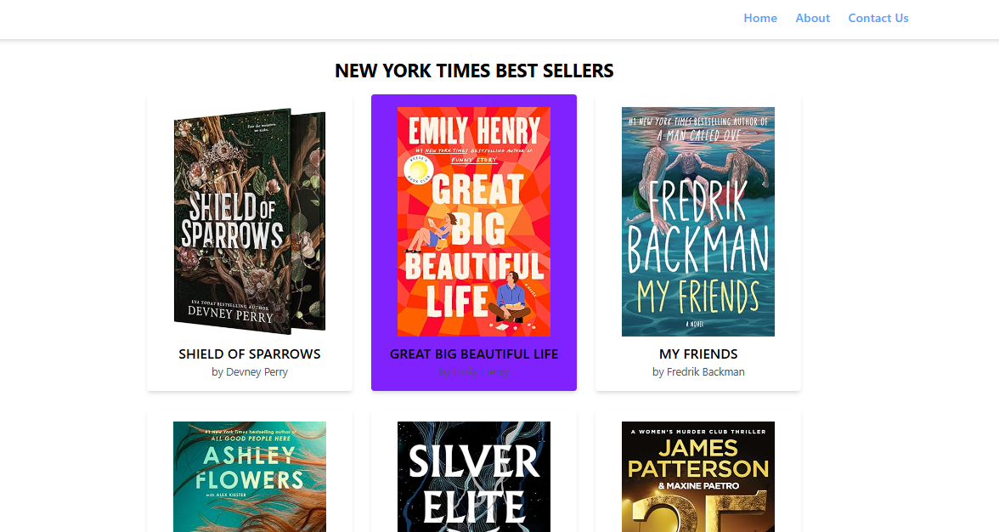
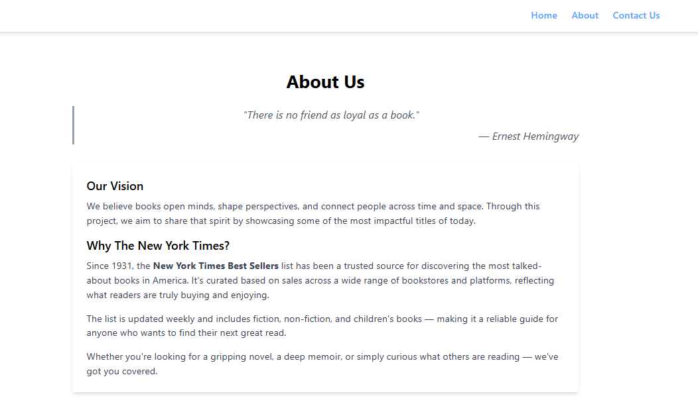
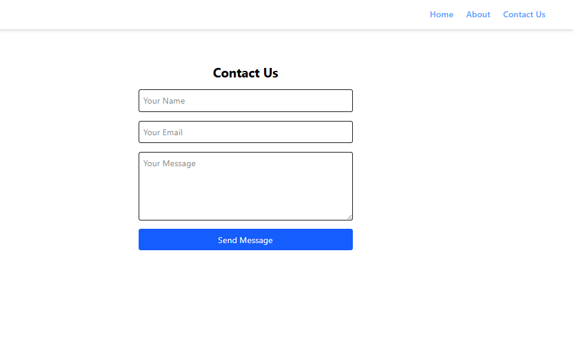

# NYT Best Sellers Viewer

A simple React web app that fetches and displays books from the New York Times Best Sellers list using the NYT Books API.

This project uses:

📦 React with functional components

💨 Tailwind CSS for styling

🌐 React Router for navigation

🔑 Your own NYT API key to fetch real-time data

## Preview





## Getting Started
1. Clone this project:
```
git clone https://github.com/ranandasatria/fgo24-react-pages
```

2. Install the depedencies:
```
npm install
```

3. Run the project:
```
npm run dev
```

4. The project will be runnning at:
``` 
http://localhost:8080
```

## Depedencies

This project uses Node.js. Make sure you have Node.js installed on your machine.

- vite: to simulate an HTTP server in a local environment.

## How to contribute

Please open a Pull Request (PR) to contribute to this project.
Your PR will be reviewed and merged if necessary.

## License

This project following MIT License.

## Copyright
&copy; 2025 Kodacademy


